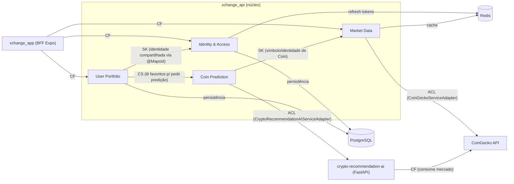
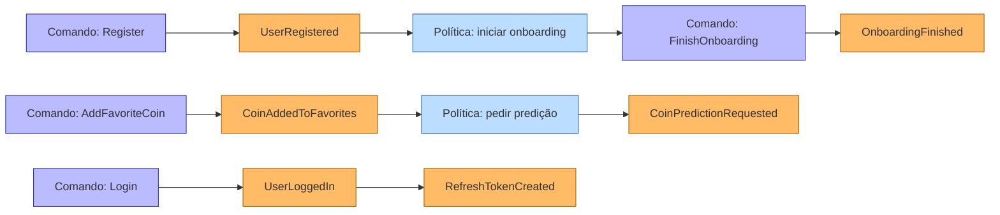

# 1. Strategic Design — xchange

[← Voltar ao índice](./README.md)

Sumário:
- [1.1 Ubiquitous Language (Glossário do Domínio)](#11-ubiquitous-language-glossário-do-domínio)
- [1.2 Bounded Contexts](#12-bounded-contexts)
- [1.3 Context Map](#13-context-map)
- [1.4 Event Storming — Big Picture](#14-event-storming--big-picture)

---

## 1.1 Ubiquitous Language (Glossário do Domínio)

Termos extraídos diretamente do código (`backend/xchange_api/src/main/java/br/com/xchange/api`).

| Termo | Definição no contexto xchange | Bounded Context | Notas / Ambiguidades |
|---|---|---|---|
| **AuthUser** | Usuário do ponto de vista de identidade e credenciais (nome, e-mail, senha hash, CPF, data de nascimento, flag de onboarding). | Identity & Access | Compartilha identidade (PK) com `Profile` via `@MapsId`. Ver [INCONSISTÊNCIA DDD] em [Bounded Contexts](#12-bounded-contexts). |
| **Profile** | Perfil do usuário que agrega as **moedas favoritas** e referencia o `AuthUser`. Raiz que protege a regra de favoritos. | User Portfolio | Mesma identidade do `AuthUser`. Atua como *aggregate root* dos favoritos. |
| **FavoriteCoin** | Moeda marcada como favorita por um usuário (`coinId`, `name`, `symbol`, `imageUrl`). | User Portfolio | Persistida como `@ElementCollection` (`FavoriteCoinsJpa`). Comporta-se como Value Object. |
| **Onboarding** | Processo de seleção inicial de 1 a 5 moedas favoritas; ao concluir, marca `onboardingFinished = true`. | User Portfolio | Regra `1..5` no DTO `OnboardingRequest`; conclusão muda estado do `AuthUser`. |
| **Coin** | Representação básica de uma criptomoeda (`id`, `name`, `symbol`, `imageUrl`, `price`, `updatedAt`). | Market Data | Base para `CoinWithMarketData` e `CoinDetailData`. |
| **CoinWithMarketData** | `Coin` + dados de mercado (preço BTC, market cap, volume, variação 24h, sparkline). | Market Data | Subclasse de `Coin`. |
| **CoinDetailData** | Detalhe completo de uma moeda (descrição, supply, ATH/ATL, variações 1h..1y, sentimento). | Market Data | Subclasse de `CoinWithMarketData`. |
| **CoinChartData** | Série temporal de preços para gráfico (lista de `[timestamp, preço]`). | Market Data | O adapter limita aos 5 últimos pontos. |
| **GlobalCoinMetricsData** | Métricas globais do mercado (market cap total, volume total, variações %). | Market Data | — |
| **TrendingCoins** | Moedas em tendência segundo o CoinGecko, enriquecidas com dados de mercado. | Market Data | `getTrendingCoinsDetailed()`. |
| **Currency / Usd** | Value Object de moeda fiduciária; `Usd` formata `BigDecimal` em dólar (`$`, `USD`). | Market Data (compartilhado) | Hierarquia `Currency` (abstrata) → `Usd`. Não há `Price` VO. |
| **CoinPrediction** | Predição de tendência para uma moeda (`id`, `symbol`, `name`, `prediction`). | Coin Prediction (IA) | `prediction` é string livre (ex.: `"alta"`, `"sem_dados"`). |
| **FavoriteCoinWithPrediction** | `FavoriteCoin` enriquecido com a `prediction` da IA. | Coin Prediction (IA) | Read model de leitura; junta Portfolio + IA. |
| **AccessToken** | JWT de curta duração (10 min) que autentica chamadas; subject = id do usuário. | Identity & Access | HMAC `HS512`, claim `authorities` sempre vazia. |
| **RefreshToken** | Token de longa duração (15 dias) guardado em Redis; troca por novo AccessToken. | Identity & Access | `id` (UUID) é o próprio token entregue ao cliente. |
| **Cpf** | Value Object com validação de CPF brasileiro (dígitos verificadores). | Identity & Access | Lança `CpfException`. |
| **BirthDate** | Value Object de data de nascimento; exige maioridade (≥ 18 anos). | Identity & Access | Lança `BirthDateException`. |
| **Register** | Caso de uso de criação de `AuthUser` + `Profile` (mesma transação). | Identity & Access | `POST /auth/register`. |
| **Login** | Autenticação por e-mail/senha; emite Access + Refresh token. | Identity & Access | `POST /auth/login` (via filtro). |
| **Refresh** | Renovação do AccessToken a partir de um RefreshToken válido. | Identity & Access | `POST /auth/refresh`. |
| **prediction** | Termo **ambíguo**: parâmetro de query (`?prediction=true`) **e** atributo de domínio. | Portfolio / IA | Ver nota de ambiguidade abaixo. |

**Ambiguidades destacadas:**

- **`prediction`** existe como (a) flag HTTP que seleciona a variante "com predição"
  do endpoint de favoritos (`GET /profile/favorite-coins?prediction=true`) e como
  (b) atributo de domínio em `CoinPrediction.prediction`. São o mesmo conceito de
  negócio visto de ângulos diferentes (intenção de leitura vs. dado).
- **`Profile`** carrega responsabilidades de **dois** contextos (identidade e
  portfólio) — ver `[INCONSISTÊNCIA DDD]` na seção de Bounded Contexts.
- **`Coin`** aparece em três contextos: como dado de mercado (Market Data), como
  favorito (`FavoriteCoin` em Portfolio) e como alvo de predição (IA). É um
  **Shared Kernel** conceitual reduzido ao identificador/símbolo da moeda.

---

## 1.2 Bounded Contexts

Quatro contextos foram identificados no código. O briefing previa um contexto
`Notification` que **não existe** e omitia o contexto de **Predição por IA**, que
**existe**.

### Identity & Access (Identidade & Acesso)
**Responsabilidade:** Cadastro e autenticação de usuários; emissão, validação e
renovação de tokens (Access/Refresh); guarda de credenciais.
**Linguagem Ubíqua local:** `AuthUser`, `AccessToken`, `RefreshToken`, `Cpf`,
`BirthDate`, `Register`, `Login`, `Refresh`.
**Capabilities:**
- Registrar usuário com validação de CPF, e-mail, maioridade e força de senha.
- Autenticar por e-mail/senha (Argon2) e emitir JWT + Refresh Token.
- Renovar Access Token a partir de Refresh Token válido.
- Validar Access Token em cada requisição (filtro stateless).
**Dependências:** PostgreSQL (usuários), Redis (refresh tokens), Spring Security.

### Market Data (Dados de Mercado)
**Responsabilidade:** Fornecer dados de mercado de criptomoedas (lista, detalhe,
gráfico, métricas globais, tendências, busca) traduzidos do CoinGecko para o
domínio.
**Linguagem Ubíqua local:** `Coin`, `CoinWithMarketData`, `CoinDetailData`,
`CoinChartData`, `GlobalCoinMetricsData`, `TrendingCoins`, `Currency`/`Usd`.
**Capabilities:**
- Listar moedas com dados de mercado (completa e compacta).
- Detalhar uma moeda; servir série de preços para gráfico.
- Métricas globais e moedas em tendência.
- Buscar moedas por texto (limitada a 20 resultados).
**Dependências:** CoinGecko (OHS externo), Redis (cache de respostas).

### User Portfolio (Portfólio / Favoritos do Usuário)
**Responsabilidade:** Gerenciar as moedas favoritas de cada usuário e o fluxo de
onboarding, respeitando o limite de 5 favoritos.
**Linguagem Ubíqua local:** `Profile`, `FavoriteCoin`, `Onboarding`,
`MAX_FAVORITE_COINS`.
**Capabilities:**
- Concluir onboarding (selecionar 1–5 favoritos).
- Adicionar/remover favorito; consultar favoritos.
- Garantir invariantes: máximo 5 e sem duplicatas.
**Dependências:** PostgreSQL (perfil + favoritos), Identity & Access (identidade
compartilhada).

### Coin Prediction (Predição/Recomendação por IA)
**Responsabilidade:** Enriquecer moedas favoritas com uma predição de tendência
calculada por um modelo de machine learning externo.
**Linguagem Ubíqua local:** `CoinPrediction`, `FavoriteCoinWithPrediction`,
`prediction`.
**Capabilities:**
- Obter predição por lista de símbolos.
- Compor favoritos + predição como read model.
**Dependências:** Serviço `crypto-recommendation-ai` (FastAPI), que por sua vez
consome CoinGecko.

> **[INCONSISTÊNCIA DDD] — `Profile` cruza dois Bounded Contexts.** O aggregate
> `Profile` referencia `AuthUser` (Identity & Access) **e** agrega `FavoriteCoin`
> (User Portfolio) na mesma entidade, com PK compartilhada via `@MapsId`. Isso
> acopla identidade e portfólio num único aggregate transacional. Sugestão: manter
> `AuthUser` como aggregate de Identidade e referenciar o usuário em `Profile`
> apenas por `UserId` (Value Object), sem `@OneToOne` bidirecional. Ver
> [Recomendações de Refatoração](./07-refactoring-recommendations.md).

> **[INCONSISTÊNCIA DDD] — Ausência de RBAC apesar da infraestrutura sugerir.** Há
> `getAuthorities()` no JWT e `SimpleGrantedAuthority` nos filtros, mas a claim é
> sempre `List.of()`. Não existe contexto de autorização baseado em papéis. O
> briefing previa `Role`/`Policy` — tratar como trabalho futuro, não como domínio
> atual.

---

## 1.3 Context Map

**Explicação dos relacionamentos:**

- **`xchange_app → IAM/MKT/POR` (CF — Conformist):** o BFF e o app consomem os
  contratos REST da API como vêm, sem traduzir o modelo; conformam-se ao formato
  publicado pela API.
- **`User Portfolio → Identity & Access` (SK — Shared Kernel):** os dois contextos
  compartilham a **identidade do usuário** (mesma PK via `@MapsId`). É um Shared
  Kernel involuntário e acoplado — ver `[INCONSISTÊNCIA DDD]` acima.
- **`Coin Prediction → Market Data` (SK):** ambos dependem da noção de `Coin`
  (sobretudo `symbol`), formando um kernel compartilhado mínimo em torno do
  identificador de moeda.
- **`User Portfolio → Coin Prediction` (CS — Customer/Supplier):** o Portfólio é o
  *cliente* que leva sua lista de símbolos favoritos ao *fornecedor* de predições.
- **`Market Data → CoinGecko` (ACL sobre um OHS):** o CoinGecko é um **Open Host
  Service** externo (REST público versionado). A `xchange_api` o protege com uma
  **Anti-Corruption Layer** (`CoinGeckoServiceAdapter`) que traduz DTOs do CoinGecko
  para o modelo de domínio.
- **`Coin Prediction → crypto-recommendation-ai` (ACL):** a tradução
  `CoinPredictionResponse → CoinPrediction` ocorre em
  `CryptoRecommendationAIServiceAdapter`, isolando o formato do serviço de IA.
- **`crypto-recommendation-ai → CoinGecko` (CF):** o serviço de IA coleta dados de
  mercado conformando-se ao formato do CoinGecko.

> `OHS`/`PL` (Open Host Service / Published Language) **não são expostos pela
> própria `xchange_api`**: ela não publica um contrato versionado formal; os
> controllers REST são consumidos diretamente. `[INFERIDO]` a partir da ausência de
> versionamento de API e de documentação OpenAPI publicada (há dependências
> Swagger no `pom.xml`, mas sem contrato publicado como PL).

---

## 1.4 Event Storming — Big Picture

> **[INFERIDO] — Não há Domain Events implementados.** O código **não** usa
> `ApplicationEventPublisher`, `@DomainEvents`, filas ou um event bus. Os "eventos"
> abaixo são **candidatos** (momentos de negócio relevantes onde um evento de
> domínio faria sentido), derivados dos fluxos existentes. A coluna *Disparado por*
> aponta o ponto exato do código onde o evento poderia ser emitido hoje.

| Evento (candidato) | Bounded Context | Disparado por | Consumidores (potenciais) | Assíncrono? |
|---|---|---|---|---|
| `UserRegistered` | Identity & Access | `RegisterUserUseCase.execute()` (após salvar `Profile`) | Onboarding (iniciar fluxo), e-mail de boas-vindas | Idealmente sim |
| `UserLoggedIn` | Identity & Access | `XchangeAuthenticationFilter.successfulAuthentication()` | Auditoria, métricas | Sim |
| `RefreshTokenCreated` | Identity & Access | `CreateRefreshTokenUseCase.execute()` | — (hoje só persistência Redis) | Não |
| `AccessTokenRefreshed` | Identity & Access | `RefreshAccessTokenUseCase.execute()` | Auditoria | Sim |
| `OnboardingFinished` | User Portfolio | `FinishOnboardingUseCase.execute()` | Predição (pré-aquecer cache), analytics | Sim |
| `CoinAddedToFavorites` | User Portfolio | `AddFavoriteCoinUseCase.execute()` | Predição, notificações [futuro] | Sim |
| `CoinRemovedFromFavorites` | User Portfolio | `RemoveFavoriteCoinUseCase.execute()` | Predição, analytics | Sim |
| `FavoriteLimitExceeded` | User Portfolio | `Profile.addFavoriteCoin()` (lança exceção) | UI (feedback) | Não (síncrono) |
| `MarketDataServed` / `MarketDataCached` | Market Data | `@Cacheable` em `CoinsController` | Observabilidade | N/A |
| `CoinPredictionRequested` | Coin Prediction | `GetFavoriteCoinsWithPredictionByUserId.execute()` | — | Síncrono (HTTP) |

O diagrama acima é uma **leitura prospectiva** (não reflete eventos reais em
runtime): mostra como comandos existentes hoje (`Register`, `Login`,
`FinishOnboarding`, `AddFavoriteCoin`) se conectariam a eventos de domínio e
políticas se o sistema adotasse mensageria/`ApplicationEventPublisher`. Hoje essas
transições são chamadas síncronas e diretas dentro dos use cases. A adoção de
eventos é registrada como recomendação em
[Recomendações de Refatoração](./07-refactoring-recommendations.md).
