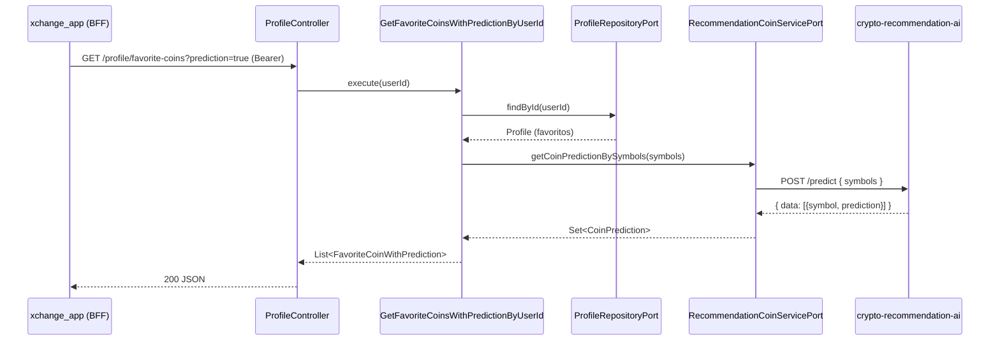

# 3. Application Layer — xchange

[← Voltar ao índice](./README.md)

Sumário:
- [3.1 Use Cases / Application Services](#31-use-cases--application-services)
- [3.2 Mapeamento Endpoints → Use Cases](#32-mapeamento-endpoints--use-cases)

Pacote-base: `br.com.xchange.api.application.usecase`. Cada use case é um
`@Service` com um único método público `execute(...)`.

> **Autorização (real):** o `SecurityConfigDev` define apenas dois níveis —
> `permitAll` para `/auth/**` e `authenticated()` para `/coins/**` e `/profile/**`.
> **Não há papéis/scopes**; portanto a coluna *Autorização* abaixo usa
> `público` ou `autenticado`. RBAC (`ROLE_*`/`POLICY_*`) é `[INFERIDO]`/futuro.

---

## 3.1 Use Cases / Application Services

### Identity & Access

#### UC-001: Register User
**Bounded Context:** Identity & Access · **Tipo:** Command
**Input:** `RegisterUserRequest { email, cpf, first_name, last_name, password, birth_date }`
**Output:** `ProfileResponse { id, authUser{...}, favoriteCoins[] }`
**Fluxo:**
1. Verifica se já existe `AuthUser` com o e-mail → `UserAlreadyExistsException` (409).
2. Faz hash da senha (`PasswordEncoderPort`, Argon2).
3. Cria `AuthUser` (valida `Cpf`/`BirthDate` nos VOs) e persiste.
4. Cria `Profile` vinculado e persiste (mesma transação).
**Autorização:** público.

#### UC-002: Login *(via filtro, não use case)*
**Bounded Context:** Identity & Access · **Tipo:** Command
**Input:** `LoginUserRequest { email, password }`
**Output:** `LoginResponse { access_token, refresh_token }`
**Fluxo:**
1. `XchangeAuthenticationFilter.attemptAuthentication` lê o corpo e delega ao `AuthenticationManager`.
2. `XchangeAuthenticationProvider` carrega o usuário e confere a senha (Argon2).
3. Em sucesso: gera Access Token (`AccessTokenServicePort`) e Refresh Token (`RefreshTokenService`).
**Autorização:** público.
> `[INCONSISTÊNCIA DDD]` o login é orquestrado num **filtro de segurança**, não num
> use case da camada de aplicação — lógica de aplicação vazou para a infraestrutura.

#### UC-003: Refresh Access Token
**Bounded Context:** Identity & Access · **Tipo:** Command
**Input:** `RefreshTokenRequest { refresh_token: UUID }`
**Output:** `LoginResponse { access_token, refresh_token }`
**Fluxo:**
1. `RefreshTokenService.validate(id)` busca o refresh no Redis → `RefreshTokenNotFoundException` (401) se ausente.
2. Confirma que o `userId` existe → `UserNotFoundException`.
3. Gera novo Access Token (`generateFromUserId`).
**Autorização:** público (porta o próprio refresh token).

#### UC-004: Create Refresh Token *(interno)*
**Tipo:** Command · **Input:** `userId` · **Output:** `RefreshToken`
**Fluxo:** rejeita se já existe refresh para o usuário (`RefreshTokenAlreadyExistsException`); senão cria e salva no Redis.
**Autorização:** interno (chamado no login).

#### UC-005: Get Refresh Token By User Id *(interno)*
**Tipo:** Query · **Input:** `userId` · **Output:** `RefreshToken` · **Autorização:** interno.

### User Portfolio

#### UC-010: Get Profile
**Tipo:** Query · **Input:** `userId` (do token) · **Output:** `ProfileResponse` / `ProfileSimpleResponse`
**Fluxo:** busca `Profile` por id → `InvalidUserException` (401) se ausente.
**Autorização:** autenticado.

#### UC-011: Finish Onboarding
**Tipo:** Command · **Input:** `userId` + `OnboardingRequest { favorite_coins: Set<FavoriteCoin> (1..5) }` · **Output:** `void` (201)
**Fluxo:**
1. Carrega `Profile`; limpa favoritos e define os novos.
2. `authUser.finishOnboarding()`.
3. Persiste.
**Autorização:** autenticado.

#### UC-012: Add Favorite Coin
**Tipo:** Command · **Input:** `userId` + `FavoriteCoinRequest { coinId, name, symbol, imageUrl }` · **Output:** `Set<FavoriteCoin>` (201)
**Fluxo:** carrega `Profile`; `profile.addFavoriteCoin(coin)` (aplica limite 5 e dedupe); persiste.
**Erros:** `FavoriteCoinsLimitExceededException` (409), `UserNotFoundException`.
**Autorização:** autenticado.

#### UC-013: Remove Favorite Coin
**Tipo:** Command · **Input:** `userId` + `coinId` · **Output:** `Set<FavoriteCoin>` (200)
**Fluxo:** carrega `Profile`; `removeFavoriteCoin(coinId)`; persiste.
**Autorização:** autenticado.

#### UC-014: Get Favorite Coins
**Tipo:** Query · **Input:** `userId` · **Output:** `Set<FavoriteCoin>` · **Autorização:** autenticado.

#### UC-015: Get Favorite Coins With Prediction *(cruza Portfolio + IA)*
**Tipo:** Query · **Input:** `userId` · **Output:** `List<FavoriteCoinWithPrediction>`
**Fluxo:**
1. Carrega favoritos do `Profile`.
2. Extrai símbolos e chama `RecommendationCoinServicePort.getCoinPredictionBySymbols`.
3. Compõe cada favorito com sua `prediction` (ou `null`).
**Autorização:** autenticado.

### Market Data

#### UC-020: Get Coins With Market Data
**Tipo:** Query · **Output:** `CoinsListResponse` (e `SimpleCoinsListResponse`) · cacheado (`coinsList`/`simpleCoinsList`).
#### UC-021: Get Trending Coins
**Tipo:** Query · **Output:** `TrendingCoinResponse` · cache `trendingCoins`.
#### UC-022: Get Global Coin Metrics
**Tipo:** Query · **Output:** `GlobalCoinMetricsResponse` · cache `globalCoinMetrics`.
#### UC-023: Get Coin Chart Data
**Tipo:** Query · **Input:** `coinId` · **Output:** `CoinChartDataResponse` · cache `coinChart`.
#### UC-024: Get Coin Detail By Id
**Tipo:** Query · **Input:** `coinId` · **Output:** `CoinDetailResponse` · cache `coinDetail`.
#### UC-025: Search Coins By Query
**Tipo:** Query · **Input:** `query` · **Output:** `CoinsByQueryResponse` (≤ 20) · cache `coinsByQuery`.

Todos os UC-02x: **autenticado** (rota `/coins/**`).

---

## 3.2 Mapeamento Endpoints → Use Cases

| Método | Path | Use Case | Bounded Context | Autorização |
|--------|------|----------|-----------------|-------------|
| POST | `/auth/register` | UC-001 Register User | Identity & Access | público |
| POST | `/auth/login` | UC-002 Login *(filtro)* | Identity & Access | público |
| POST | `/auth/refresh` | UC-003 Refresh Access Token | Identity & Access | público |
| GET | `/profile/details` | UC-010 Get Profile (detalhado) | User Portfolio | autenticado |
| GET | `/profile/simple` | UC-010 Get Profile (simples) | User Portfolio | autenticado |
| POST | `/profile/onboarding` | UC-011 Finish Onboarding | User Portfolio | autenticado |
| GET | `/profile/favorite-coins` | UC-014 Get Favorite Coins | User Portfolio | autenticado |
| GET | `/profile/favorite-coins?prediction=true` | UC-015 Get Favorite Coins With Prediction | User Portfolio + IA | autenticado |
| POST | `/profile/favorite-coins` | UC-012 Add Favorite Coin | User Portfolio | autenticado |
| DELETE | `/profile/favorite-coins/{coinId}` | UC-013 Remove Favorite Coin | User Portfolio | autenticado |
| GET | `/coins/list` | UC-020 Get Coins With Market Data | Market Data | autenticado |
| GET | `/coins/simple` | UC-020 (variante compacta) | Market Data | autenticado |
| GET | `/coins/trending` | UC-021 Get Trending Coins | Market Data | autenticado |
| GET | `/coins/global` | UC-022 Get Global Coin Metrics | Market Data | autenticado |
| GET | `/coins/chart/{coinId}` | UC-023 Get Coin Chart Data | Market Data | autenticado |
| GET | `/coins/detail/{coinId}` | UC-024 Get Coin Detail By Id | Market Data | autenticado |
| GET | `/coins/search?query=` | UC-025 Search Coins By Query | Market Data | autenticado |

> **Diagrama de sequência — `GET /profile/favorite-coins?prediction=true` (UC-015):**

O fluxo acima mostra a colaboração **Customer/Supplier** entre User Portfolio
(cliente) e Coin Prediction (fornecedor): o use case carrega os favoritos do
perfil, leva os símbolos ao port de recomendação, e a ACL
(`CryptoRecommendationAIServiceAdapter`) traduz a resposta do serviço de IA em
`CoinPrediction`, que o use case funde com os favoritos no read model
`FavoriteCoinWithPrediction`. Se o serviço de IA falhar, o adapter devolve `null`
(o use case associa `prediction = null`), preservando a resiliência da leitura.
