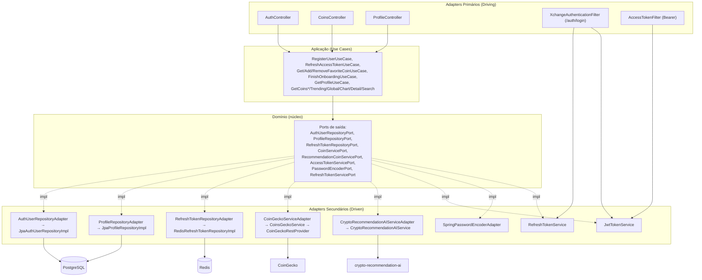

# 4. Infrastructure Mapping — xchange

[← Voltar ao índice](./README.md)

Sumário:
- [4.1 Ports & Adapters](#41-ports--adapters)
- [4.2 Anti-Corruption Layers](#42-anti-corruption-layers)
- [4.3 Estrutura de Pacotes Recomendada](#43-estrutura-de-pacotes-recomendada)

---

## 4.1 Ports & Adapters



**Tabela resumo:**

| Categoria | Componentes (classes reais) |
|---|---|
| **Adapters Primários (Driving)** | `AuthController`, `CoinsController`, `ProfileController`, `XchangeAuthenticationFilter`, `AccessTokenFilter` |
| **Ports de Entrada (Input Ports)** | *Implícitos* — os use cases (`*UseCase`) são chamados diretamente pelos controllers. `[INCONSISTÊNCIA DDD]`: não há interface de input port; o controller depende da classe concreta do use case. |
| **Ports de Saída (Output Ports)** | `AuthUserRepositoryPort`, `ProfileRepositoryPort`, `RefreshTokenRepositoryPort`, `CoinServicePort`, `RecommendationCoinServicePort`, `AccessTokenServicePort`, `PasswordEncoderPort`, `RefreshTokenServicePort` |
| **Adapters Secundários (Driven)** | `AuthUserRepositoryAdapter`, `ProfileRepositoryAdapter`, `RefreshTokenRepositoryAdapter`, `CoinGeckoServiceAdapter`, `CryptoRecommendationAIServiceAdapter`, `JwtTokenService`, `SpringPasswordEncoderAdapter`, `RefreshTokenService` |

O diagrama evidencia a **regra de dependência hexagonal**: controllers e filtros
(driving) chamam use cases, que dependem apenas de **ports de saída** do domínio;
as implementações concretas (driven) ficam na borda e são injetadas pelo Spring.
A única quebra relevante é a ausência de **input ports** explícitos — os
controllers acoplam-se às classes concretas dos use cases em vez de a interfaces.

---

## 4.2 Anti-Corruption Layers

### ACL: CoinGecko Market Data
**Contexto externo:** CoinGecko REST API (Open Host Service público).
**Contexto interno:** Market Data.
**Tradução realizada:** DTOs do CoinGecko (`CoinInListWithMarketData`, `CoinDetail`,
`CoinHistoricalChartData`, `CoinsByQuery`, `GlobalCoinMetrics`,
`TrendingCoinsCoinsGecko`) → entidades de domínio (`Coin`, `CoinWithMarketData`,
`CoinDetailData`, `CoinChartData`, `GlobalCoinMetricsData`). Inclui formatação de
preços em USD (via `Usd`), corte dos últimos 5 pontos do gráfico e limite de 20
resultados de busca.
**Classe(s) responsável(eis):** `CoinGeckoServiceAdapter` (tradução/domínio),
`CoinsGeckoService` (montagem de chamadas), `CoinGeckoRestProvider` (HTTP + API key).

### ACL: Crypto Recommendation AI
**Contexto externo:** serviço `crypto-recommendation-ai` (FastAPI, `POST /predict`).
**Contexto interno:** Coin Prediction.
**Tradução realizada:** `CoinPredictionResponse` (JSON `{ data: [{id,symbol,name,prediction}] }`)
→ `Set<CoinPrediction>`. Em falha, devolve resultado neutro/`null` (resiliência).
**Classe(s) responsável(eis):** `CryptoRecommendationAIServiceAdapter`,
`CryptoRecommendationAIService`.

### ACL: Spring Security ↔ Domínio
**Contexto externo:** Spring Security (`UserDetails`, `Authentication`).
**Contexto interno:** Identity & Access.
**Tradução realizada:** `AuthUser`/`AuthUserJpa` ↔ `XchangeUserDetails`;
`PasswordEncoder` ↔ `PasswordEncoderPort`.
**Classe(s) responsável(eis):** `XchangeUserDetailsService`, `XchangeUserDetails`,
`SpringPasswordEncoderAdapter`, `XchangeAuthenticationProvider`.

> `[INFERIDO]` O CoinGecko é tratado como **OHS** (contrato público estável) e a
> `xchange_api` deliberadamente o encapsula atrás de uma ACL — essa é a fronteira
> de proteção mais bem definida do sistema.

---

## 4.3 Estrutura de Pacotes Recomendada

**Estado atual (resumido):** o backend hoje organiza por **camada técnica**
(`domain` / `application` / `infra`), com todos os contextos misturados dentro de
cada camada:

```
br.com.xchange.api/
├── domain/            (entities, valueobject, ports, exceptions)  ← todos os BCs juntos
├── application/       (usecase, dto, utils)                        ← todos os BCs juntos
└── infra/             (adapters, controllers, entities, filters, config, services, providers, handlers)
```

**Recomendação (package-by-bounded-context, mantendo hexagonal):** alinhar a
estrutura aos Bounded Contexts identificados, preservando a Linguagem Ubíqua:

```
br.com.xchange/
  identityaccess/
    domain/
      model/            (AuthUser, RefreshToken)
      valueobject/      (Cpf, BirthDate, UserId)
      service/          (RefreshTokenPolicy)
      repository/       (AuthUserRepository, RefreshTokenRepository) ← ports
      event/            (UserRegistered, AccessTokenRefreshed)       [INFERIDO]
    application/
      usecase/          (RegisterUserUseCase, RefreshAccessTokenUseCase, ...)
      port/
        in/             (RegisterUser, RefreshAccessToken)           ← input ports
        out/            (AccessTokenService, PasswordEncoder)        ← service ports
    infrastructure/
      persistence/jpa/  (AuthUserJpa, AuthUserRepositoryAdapter)
      persistence/redis/(RefreshTokenRedis, RefreshTokenRepositoryAdapter)
      security/         (JwtTokenService, filtros, handlers, providers)
      web/              (AuthController)

  marketdata/
    domain/
      model/            (Coin, CoinWithMarketData, CoinDetailData, CoinChartData, GlobalCoinMetricsData)
      valueobject/      (Currency, Usd, Price [NOVO sugerido])
      repository/       (CoinMarketDataService)                      ← service port
    application/usecase/(GetCoinsWithMarketDataUseCase, ...)
    infrastructure/
      coingecko/        (CoinGeckoServiceAdapter, CoinsGeckoService, CoinGeckoRestProvider, dto/)  ← ACL
      cache/            (RedisCacheConfig)
      web/              (CoinsController)

  userportfolio/
    domain/
      model/            (Profile, FavoriteCoin)
      repository/       (ProfileRepository)
    application/usecase/(FinishOnboardingUseCase, Add/RemoveFavoriteCoinUseCase, GetFavoriteCoins*)
    infrastructure/
      persistence/jpa/  (ProfileJpa, FavoriteCoinsJpa, ProfileRepositoryAdapter)
      web/              (ProfileController)

  coinprediction/
    domain/
      model/            (CoinPrediction, FavoriteCoinWithPrediction)
      repository/       (CoinPredictionService)                      ← service port
    application/usecase/(GetFavoriteCoinsWithPredictionByUserId)
    infrastructure/ai/  (CryptoRecommendationAIServiceAdapter, CryptoRecommendationAIService, dto/)  ← ACL

  shared/               (kernel compartilhado mínimo: identificadores, erros base)
```

A reorganização acima torna cada **Bounded Context** um módulo autossuficiente
(domínio → aplicação → infraestrutura) e explicita os **input ports**
(`application/port/in`) hoje ausentes. Ela também dá um lar claro ao contexto de
**Coin Prediction** (hoje espalhado em `infra/services/crypto_recommendation_ai`) e
isola as duas ACLs (`coingecko/`, `ai/`). A pasta `shared/` hospeda o pequeno
**Shared Kernel** (identidade de usuário e de moeda) — que deve ser mantido
intencionalmente pequeno para não reacoplar os contextos.
