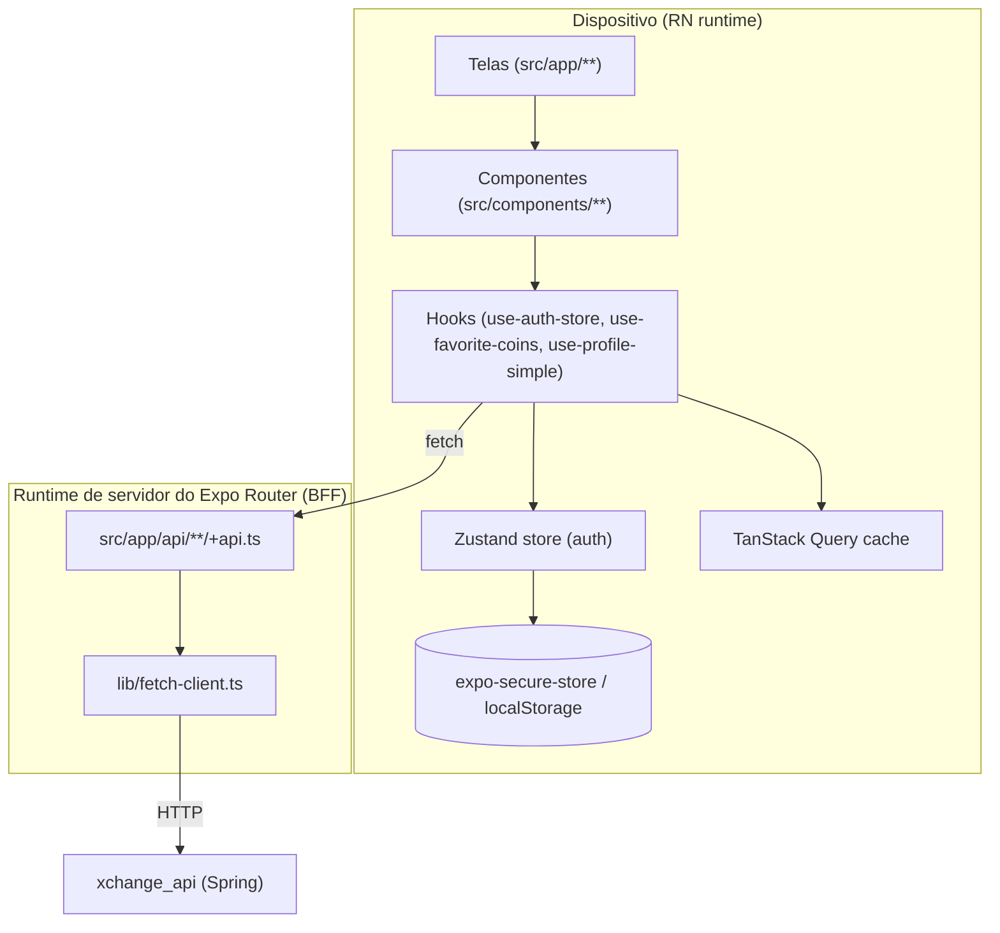

# 6. Frontend — `xchange_app` (Expo / React Native)

[← Voltar ao índice](./README.md)

> O frontend não segue DDD (é uma camada de apresentação), mas faz parte do
> projeto. Esta seção documenta sua arquitetura e como ele consome os Bounded
> Contexts do backend, preservando a Linguagem Ubíqua.

Sumário:
- [6.1 Visão geral e camadas](#61-visão-geral-e-camadas)
- [6.2 BFF — Expo API Routes](#62-bff--expo-api-routes)
- [6.3 Estado: Zustand + TanStack Query](#63-estado-zustand--tanstack-query)
- [6.4 Autenticação e armazenamento seguro](#64-autenticação-e-armazenamento-seguro)
- [6.5 Mapa de telas → contextos](#65-mapa-de-telas--contextos)

---

## 6.1 Visão geral e camadas

Stack confirmado em `app/xchange_app/`:

- **Expo SDK 54 / React Native** com **Expo Router** (file-based routing em `src/app`).
- **Zustand** (estado local/sessão) + **expo-zustand-persist**.
- **TanStack Query** (estado remoto/cache de servidor) — `src/lib/query-client.ts`.
- **expo-secure-store** (tokens em armazenamento seguro nativo; `localStorage` no web).
- **Gráficos**: bibliotecas de chart (preços) nos componentes de detalhe de moeda.
- **Estilização**: Tailwind/uniwind (`components.json`, `postcss.config.mjs`).
- **Value Objects de UI**: `src/valueobject/` (`Time`, `Hour`, `Minute`) com testes.
- **Schemas**: `src/schemas/onboarding-schema.ts` (validação de onboarding com testes).



As telas consomem componentes e hooks; os hooks combinam **estado de sessão**
(Zustand) com **estado remoto** (TanStack Query). Toda chamada de rede sai por
rotas `+api.ts` (o BFF), nunca direto para a API Spring a partir da tela — isso
centraliza host, headers e o formato de resposta amigável ao app.

---

## 6.2 BFF — Expo API Routes

`src/app/api/**/+api.ts` são **handlers de servidor** (Expo Router API Routes) que
agem como Backend-for-Frontend. Eles recebem a requisição do app, repassam para a
`xchange_api` via `lib/fetch-client.ts` (usando `EXPO_PUBLIC_API_URL`, default
`http://localhost:8080`) e normalizam a resposta (ex.: `{ code, message, access_token, refresh_token }`).

Rotas BFF identificadas:
- `api/auth/login+api.ts`, `api/auth/register+api.ts`, `api/auth/refresh+api.ts`
- `api/coins/...` (lista, `chart`, `details`)
- `api/profile/...`, `api/profile/favorite-coins/...`

> **Conformist (CF):** o BFF conforma-se ao contrato da `xchange_api` — apenas
> adapta a casca da resposta (mensagens amigáveis, `code`), sem reinterpretar o
> modelo de domínio.

---

## 6.3 Estado: Zustand + TanStack Query

- **Zustand (`src/hooks/use-auth-store.ts`)** guarda `isAuthenticated`,
  `onboardingFinished`, `accessToken`, `refreshToken` e as ações `logIn`, `logOut`,
  `startOnboarding`, `finishOnboarding`. É **persistido** via `expo-zustand-persist`.
- **TanStack Query** guarda o estado remoto (perfil, favoritos, moedas). Ações de
  auth interagem com o cache: `logIn` remove `["profile-simple"]` para reavaliar o
  onboarding com dados do novo usuário; `logOut` faz `queryClient.clear()`.

> **Detalhe de design importante (no código):** `onboardingFinished` é
> **derivado do servidor** (resposta de `/profile/simple`), não um valor cacheado.
> O `merge` da hidratação do store **preserva** o `onboardingFinished` de runtime
> para que a hidratação assíncrona do secure-store não sobrescreva o valor recém
> definido por `startOnboarding()` e mande um usuário novo para as tabs em vez do
> onboarding.

---

## 6.4 Autenticação e armazenamento seguro

- Tokens são persistidos com **`expo-secure-store`** em nativo
  (`getItemAsync/setItemAsync/deleteItemAsync`) e **`localStorage`** no web — um
  adaptador de storage unificado em `use-auth-store.ts`.
- O fluxo de login chama `api/auth/login+api.ts`, recebe `access_token` +
  `refresh_token` e chama `logIn(...)`; o `refresh+api.ts` cobre a renovação.

```mermaid
sequenceDiagram
  participant UI as Tela de Login
  participant Store as useAuthStore (Zustand)
  participant BFF as api/auth/login+api.ts
  participant API as xchange_api

  UI->>BFF: POST /api/auth/login {email,password}
  BFF->>API: POST /auth/login
  API-->>BFF: { access_token, refresh_token }
  BFF-->>UI: { code, access_token, refresh_token, message }
  UI->>Store: logIn({accessToken, refreshToken})
  Store->>Store: persiste em secure-store; limpa query "profile-simple"
```

O diagrama mostra o caminho do login pelo BFF: a tela nunca fala direto com a API;
o handler `+api.ts` faz a tradução de borda e devolve uma resposta já normalizada,
que alimenta o store de auth e dispara a repersistência segura dos tokens.

---

## 6.5 Mapa de telas → contextos

| Tela / componente (`src/app`, `src/components`) | Consome (Bounded Context) | Endpoint(s) backend |
|---|---|---|
| `(tabs)/index.tsx`, `coins-list.tsx`, `trending-coins.tsx`, `global-coins-header.tsx` | Market Data | `/coins/list`, `/coins/trending`, `/coins/global` |
| `coin/[coinId].tsx`, `coin-detail/*` | Market Data | `/coins/detail/{id}`, `/coins/chart/{id}` |
| busca de moedas (debounce) | Market Data | `/coins/search?query=` |
| `onboarding/*`, `schemas/onboarding-schema.ts` | User Portfolio | `/profile/onboarding` |
| `favorite-coins.tsx`, `use-favorite-coins.ts` | User Portfolio (+ IA) | `/profile/favorite-coins[?prediction=true]` |
| `profile/*`, `use-profile-simple.ts` | User Portfolio / Identity & Access | `/profile/simple`, `/profile/details` |
| login/registro | Identity & Access | `/auth/login`, `/auth/register`, `/auth/refresh` |

> A busca de moedas usa **debounce** no app e **cache Redis** no backend
> (`coinsByQuery`), combinando responsividade no cliente com economia de chamadas
> ao CoinGecko no servidor.
