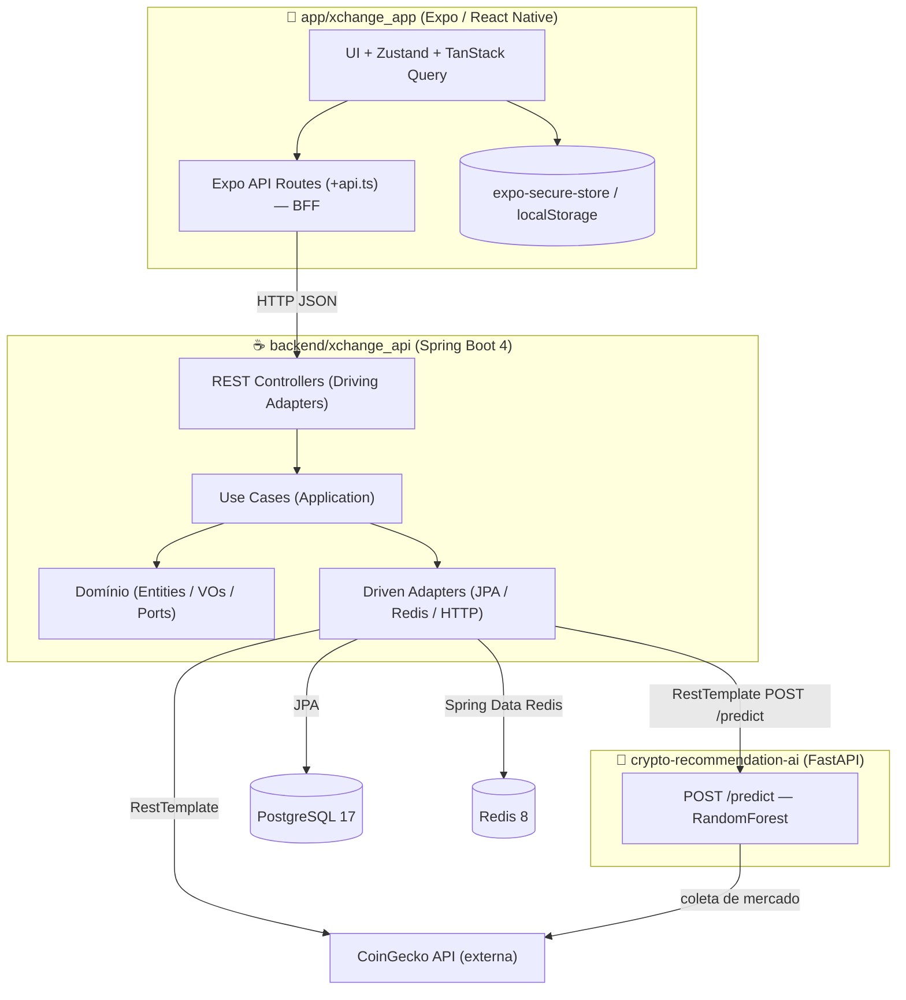

# Documentação DDD — Plataforma **xchange**

> Documentação de arquitetura orientada a Domain-Driven Design produzida a partir
> da **leitura do código-fonte real** do monorepo `xchange`. Onde uma decisão de
> design não está explícita no código, há a marca `[INFERIDO]`. Onde a
> implementação se afasta de um princípio DDD, há a marca `[INCONSISTÊNCIA DDD]`.

---

## ⚠️ Nota de fidelidade ao código (leia primeiro)

O briefing que originou esta documentação descrevia uma arquitetura-alvo
significativamente mais ambiciosa do que a implementação atual. Para preservar a
utilidade prática do documento, **tudo aqui descreve o que existe de fato no
repositório**. Os itens abaixo foram pedidos mas **não estão implementados** e
aparecem ao longo do texto marcados como lacuna/`[INFERIDO]`:

| Item do briefing | Situação real no código |
|---|---|
| Spring Authorization Server como OIDC Provider | **Ausente.** Autenticação é JWT próprio (biblioteca `jjwt`) com filtros customizados. |
| Grant type OAuth2 customizado | **Ausente.** Login é um `UsernamePasswordAuthenticationFilter` customizado em `/auth/login`. |
| RBAC em 3 camadas (User → Role → Policy) | **Ausente.** Não há entidades `Role`/`Policy`. A claim `authorities` do JWT é sempre `List.of()` (vazia). |
| Rotação de chaves JWT com `kid` | **Ausente.** Chave única simétrica HMAC (`HS512`), sem `kid`, sem rotação. |
| Token binding via `jti` allowlist no Redis | **Parcial/divergente.** O Redis guarda *refresh tokens* (`@RedisHash` com TTL), não há allowlist de `jti` de access token. |
| Rate limiting em 3 camadas (Bucket4j) | **Ausente.** Nenhuma dependência ou filtro de rate limiting. |
| Bounded Context `Notification` (FCM/APNs) | **Ausente.** Nenhum código de push notification. |
| Value Object `Price` (amount+currency+timestamp) | **Ausente.** Existem os VOs `Currency`/`Usd`, `Cpf`, `BirthDate`. |
| Domain Events (`UserRegistered`, `TokenIssued`, ...) | **Ausente.** Nenhum `ApplicationEventPublisher`/evento de domínio. Tratados como `[INFERIDO]`. |
| **Contexto de Predição/Recomendação por IA** | **Presente, mas não citado no briefing.** Serviço Python (FastAPI + RandomForest) consumido via `RecommendationCoinServicePort`. |

---

## Visão geral do sistema

`xchange` é uma plataforma full-stack de **acompanhamento de criptomoedas**. O
monorepo contém três aplicações:

```
xchange/
├── app/xchange_app/              # Frontend mobile (Expo / React Native, SDK 54)
├── backend/xchange_api/          # API principal (Spring Boot 4 / Java 25) — núcleo DDD
└── backend/crypto-recommendation-ai/  # Serviço de IA (Python / FastAPI / scikit-learn)
```

- **`xchange_api`** concentra o domínio de negócio e segue **arquitetura
  hexagonal (Ports & Adapters)** com camadas `domain` / `application` / `infra`.
- **`crypto-recommendation-ai`** é um microserviço stateless que serve predições
  de tendência ("alta"/"baixa") por símbolo de moeda, atualizadas a cada 15 min.
- **`xchange_app`** é um app Expo Router que também atua como **BFF**: rotas
  `+api.ts` no próprio app fazem proxy para a `xchange_api`.

### Diagrama de contêineres (C4 — nível 2)



O app mobile nunca fala direto com a `xchange_api` a partir do dispositivo:
ele chama suas próprias rotas `+api.ts` (executadas no runtime de servidor do
Expo Router), que por sua vez encaminham para a API Spring. A `xchange_api` é o
único componente com acesso a PostgreSQL e Redis e é quem orquestra as chamadas
ao CoinGecko (dados de mercado) e ao serviço de IA (predições). O serviço de IA é
isolado e também coleta dados do CoinGecko por conta própria para treinar/servir o
modelo.

---

## Índice geral da documentação

| # | Documento | Conteúdo |
|---|-----------|----------|
| 1 | [Strategic Design](./01-strategic-design.md) | Linguagem Ubíqua, Bounded Contexts, Context Map, Event Storming |
| 2 | [Tactical Design](./02-tactical-design.md) | Aggregates, Entities, Value Objects, Domain Events, Domain Services, Repository Ports, Factories |
| 3 | [Application Layer](./03-application-layer.md) | Use Cases e mapa Endpoints → Use Cases |
| 4 | [Infrastructure Mapping](./04-infrastructure.md) | Ports & Adapters, Anti-Corruption Layers, estrutura de pacotes |
| 5 | [Architecture Decision Records](./05-adr.md) | ADR-001 … ADR-010 |
| 6 | [Frontend](./06-frontend.md) | Arquitetura do app Expo / React Native |
| 7 | [Recomendações de Refatoração](./07-refactoring-recommendations.md) | Oportunidades alinhadas a DDD |

### Atalhos por seção

- **Strategic** → [Glossário](./01-strategic-design.md#11-ubiquitous-language-glossário-do-domínio) · [Bounded Contexts](./01-strategic-design.md#12-bounded-contexts) · [Context Map](./01-strategic-design.md#13-context-map) · [Event Storming](./01-strategic-design.md#14-event-storming--big-picture)
- **Tactical** → [Aggregates](./02-tactical-design.md#21-aggregates--aggregate-roots) · [Entities](./02-tactical-design.md#22-entities) · [Value Objects](./02-tactical-design.md#23-value-objects) · [Domain Events](./02-tactical-design.md#24-domain-events) · [Domain Services](./02-tactical-design.md#25-domain-services) · [Repository Ports](./02-tactical-design.md#26-repository-interfaces-domain-ports) · [Factories](./02-tactical-design.md#27-factories)
- **Application** → [Use Cases](./03-application-layer.md#31-use-cases--application-services) · [Endpoints → Use Cases](./03-application-layer.md#32-mapeamento-endpoints--use-cases)
- **Infra** → [Ports & Adapters](./04-infrastructure.md#41-ports--adapters) · [ACLs](./04-infrastructure.md#42-anti-corruption-layers) · [Pacotes](./04-infrastructure.md#43-estrutura-de-pacotes-recomendada)
- **ADRs** → [001](./05-adr.md#adr-001) · [002](./05-adr.md#adr-002) · [003](./05-adr.md#adr-003) · [004](./05-adr.md#adr-004) · [005](./05-adr.md#adr-005) · [006](./05-adr.md#adr-006) · [007](./05-adr.md#adr-007) · [008](./05-adr.md#adr-008) · [009](./05-adr.md#adr-009) · [010](./05-adr.md#adr-010)

---

## Stack tecnológica (confirmada no código)

| Camada | Tecnologia | Evidência |
|---|---|---|
| API | Spring Boot **4.0.4**, Java **25** | `backend/xchange_api/pom.xml` |
| Persistência | PostgreSQL 17 (JPA/Hibernate 7) | `docker-compose.yaml`, `application-dev.yaml` |
| Cache / refresh tokens | Redis 8 (Spring Data Redis) | `RedisCacheConfig`, `RefreshTokenRedis` |
| Auth | JWT `jjwt` 0.13 (HMAC `HS512`) + Spring Security | `JwtTokenService`, `SecurityConfigDev` |
| Dados de mercado | CoinGecko REST | `CoinGeckoRestProvider`, `CoinsGeckoService` |
| IA | FastAPI + scikit-learn (RandomForest) | `backend/crypto-recommendation-ai/api/app.py` |
| Mobile | Expo SDK 54, React Native, Zustand, TanStack Query | `app/xchange_app/package.json`, `src/hooks/use-auth-store.ts` |

> **Convenção de Linguagem Ubíqua:** o código está majoritariamente em **inglês**
> para artefatos de domínio (`AuthUser`, `FavoriteCoin`, `CoinPrediction`) e em
> **português** para mensagens de negócio e validações. Esta documentação preserva
> os nomes exatamente como aparecem no código.
