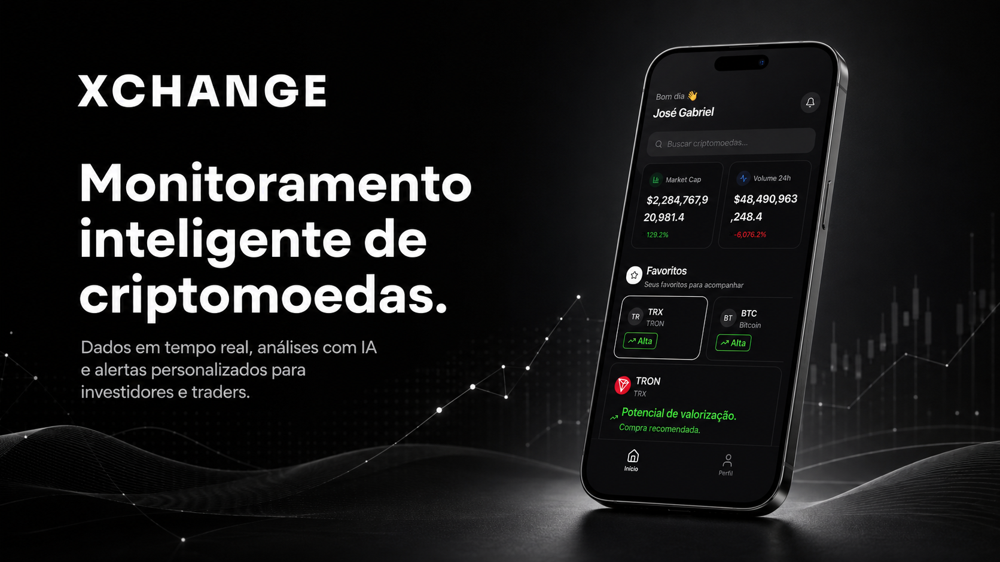

<div align="center">

# **Xchange**

### Plataforma inteligente de monitoramento de criptomoedas

</div>

---

## O mercado não para. Suas decisões também não podem esperar.

Acompanhar múltiplas criptomoedas exige atenção constante. Preços mudam em
segundos, oportunidades surgem rapidamente e informações importantes ficam
espalhadas entre diferentes ferramentas.

Investidores e traders precisam reunir **dados em tempo real**, **análises
confiáveis** e **alertas acionáveis** em um único lugar.

## Uma visão mais inteligente do seu portfólio

**Xchange** é uma plataforma mobile que simplifica o monitoramento do mercado
cripto e transforma dados complexos em informações claras para apoiar decisões
mais rápidas e conscientes.

| | Recurso | Benefício |
| :---: | --- | --- |
| 📡 | **Monitoramento em tempo real** | Acompanhe preços de criptomoedas com atualização instantânea via streaming. |
| 🧠 | **Análise com IA** | Entenda padrões de mercado e comportamentos de preço com recomendações inteligentes. |
| 🔔 | **Alertas personalizados** | Receba notificações push quando seus ativos atingirem os targets definidos. |
| 📱 | **Interface intuitiva** | Navegue por um dashboard limpo, responsivo e otimizado para dispositivos móveis. |
| 💼 | **Rastreamento de portfólio** | Gerencie posições e acompanhe a performance dos seus investimentos. |

## Tudo o que importa, em um só fluxo

```text
Mercado em tempo real  →  Análise inteligente  →  Alertas acionáveis  →  Decisões mais confiantes
```

Do acompanhamento diário à identificação de oportunidades, a Xchange mantém as
informações essenciais sempre acessíveis — sem ruído e sem alternar entre
diversas plataformas.

## Segurança de nível empresarial

A plataforma foi projetada para proteger dados e sessões com uma arquitetura
segura e preparada para crescer:

- Autenticação JWT de grade institucional
- Revogação automática de tokens
- Conformidade com padrões de criptografia assimétrica
- Arquitetura de microserviços escalável

## Performance para acompanhar o ritmo do mercado

| Capacidade | Como a Xchange entrega |
| --- | --- |
| **Respostas rápidas** | Consultas otimizadas com cache inteligente |
| **Atualizações contínuas** | Streaming de dados em tempo real via SSE |
| **Escalabilidade** | Suporte a centenas de usuários simultâneos |

---

<div align="center">

## Controle seu portfólio. Compreenda o mercado. Invista com confiança.

**Xchange** reúne tecnologia, inteligência e simplicidade para transformar a
forma como investidores e traders acompanham criptomoedas.

</div>
