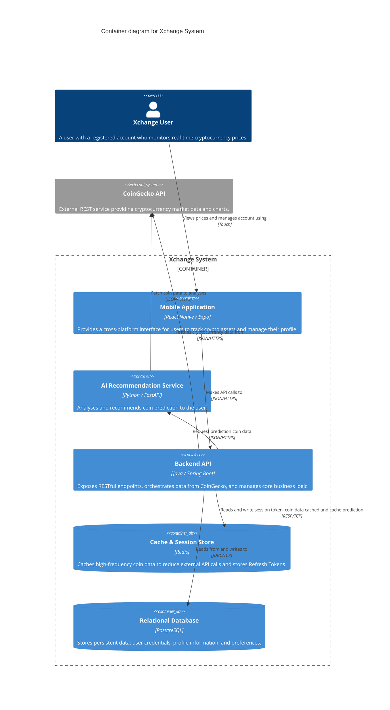

# Xchange C4: Container

```mermaid
C4Container
title Container diagram for Xchange System

Person(user, "Xchange User", "A user with a registered account who monitors real-time cryptocurrency prices.")
System_Ext(coinGecko, "CoinGecko API", "External REST service providing cryptocurrency market data and charts.")

Container_Boundary(xchangeSystem, "Xchange System") {
  Container(mobile, "Mobile Application", "React Native / Expo", "Provides a cross-platform interface for users to track crypto assets and manage their profile.")
  Container(aiCoin, "AI Recommendation Service", "Python / FastAPI", "Analyses and recommends coin prediction to the user.")
  Container(api, "Backend API", "Java / Spring Boot", "Exposes RESTful endpoints, orchestrates data from CoinGecko, and manages core business logic.")
  ContainerDb(cacheDb, "Cache & Session Store", "Redis", "Caches high-frequency coin data to reduce external API calls and stores Refresh Tokens.")
  ContainerDb(relationalDb, "Relational Database", "PostgreSQL", "Stores persistent data: user credentials, profile information, and preferences.")
}

Rel(user, mobile, "Views prices and manages account using", "Touch")
Rel(mobile, api, "Makes API calls to", "JSON/HTTPS")
Rel(api, cacheDb, "Reads and write session token, coin data cached and cache prediction", "RESP/TCP")
Rel(api, relationalDb, "Reads from and writes to", "JDBC/TCP")
Rel(api, coinGecko, "Fetches cryptocurrency data from", "JSON/HTTPS")
Rel(aiCoin, coinGecko, "Fetch coin data to analyses", "JSON/HTTPS")
Rel(api, aiCoin, "Request prediction coin data", "JSON/HTTPS")
```