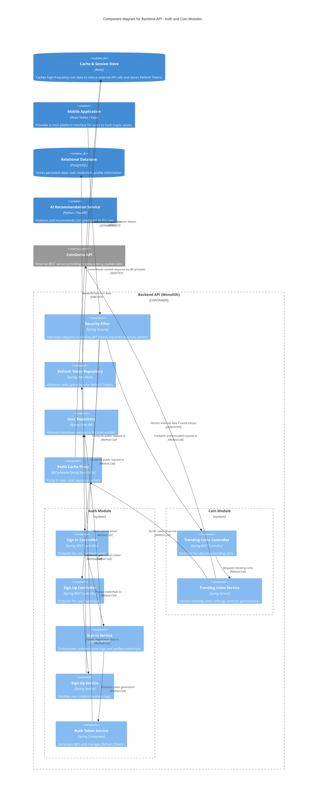

# Xchange C4: Backend API Component

```mermaid
C4Component
title Component diagram for Backend API - Auth and Coin Modules

ContainerDb(cacheDb, "Cache & Session Store", "Redis", "Caches high-frequency coin data to reduce external API calls and stores Refresh Tokens.")
Container(mobile, "Mobile Application", "React Native / Expo", "Provides a cross-platform interface for users to track crypto assets.")
ContainerDb(relationalDb, "Relational Database", "PostgreSQL", "Stores persistent data: user credentials, profile information.")
Container(aiCoin, "AI Recommendation Service", "Python / FastAPI", "Analyses and recommends coin prediction to the user.")
System_Ext(coinGecko, "CoinGecko API", "External REST service providing cryptocurrency market data.")

Container_Boundary(api, "Backend API (Monolith)") {
  Component(securityFilter, "Security Filter", "Spring Security", "Intercepts requests to validate JWT tokens and enforce access control.")
  
  Component(refreshTokenRepository, "Refresh Token Repository", "Spring Data Redis", "Abstracts redis operations for Refresh Tokens.")
  Component(userRepository, "User Repository", "Spring Data JPA", "Abstracts database operations for User entities.")

  Component(redisCacheProxy, "Redis Cache Proxy", "@Cacheable/Spring Data Redis", "Proxy to save, read response cached")

  Boundary(authService, "Auth Module") {
    Component(signInController, "Sign In Controller", "Spring REST Controller", "Endpoint for user authentication.")
    Component(signUpController, "Sign Up Controller", "Spring REST Controller", "Endpoint for user registration.")
    
    Component(signInService, "Sign In Service", "Spring Service", "Orchestrates authentication logic and verifies credentials.")
    Component(signUpService, "Sign Up Service", "Spring Service", "Handles user creation business logic.")
    Component(authTokenService, "Auth Token Service", "Spring Component", "Generates JWTs and manages Refresh Tokens.")

    Rel(signInController, signInService, "Passes credentials to", "Method Call")
    Rel(signUpController, signUpService, "Passes registration data to", "Method Call")
    
    Rel(signInService, userRepository, "Finds user by email", "Method Call")
    Rel(signUpService, userRepository, "Saves new user", "Method Call")
    Rel(signInService, authTokenService, "Requests token generation", "Method Call")
  }

  Boundary(coinService, "Coin Module") {
    Component(trendingCoinsController, "Trending Coins Controller", "Spring REST Controller", "Endpoint for returning trending coins.")
    Component(trendingCoinsService, "Trending Coins Service", "Spring Service", "Fetches trending coins, utilizing cache for performance.")

    Rel(trendingCoinsController, trendingCoinsService, "Requests trending coins", "Method Call")
  }

  %% Entry points from Mobile
  Rel(mobile, securityFilter, "Makes API requests to", "JSON/HTTPS")
  
  %% Internal Routing from Security Filter
  Rel(securityFilter, signInController, "Forwards public request to", "Method Call")
  Rel(securityFilter, signUpController, "Forwards public request to", "Method Call")
  Rel(securityFilter, trendingCoinsController, "Forwards authenticated request to", "Method Call")
}

%% External Database & Cache Relations
Rel(refreshTokenRepository, cacheDb, "Stores and retrieves Refresh Tokens", "RESP/TCP")
Rel(authTokenService, refreshTokenRepository, "Saves or gets refresh token", "Method Call")
Rel(userRepository, relationalDb, "Reads/Writes user data", "JDBC/TCP")

%% CoinGecko & Cache Relations
Rel(trendingCoinsService, coinGecko, "Fetches external data if cache misses", "JSON/HTTPS")
Rel(trendingCoinsService, redisCacheProxy, "Sends, reads response", "Method Call")
Rel(redisCacheProxy, cacheDb, "Saves/Reads cached response via @Cacheable", "RESP/TCP")
```