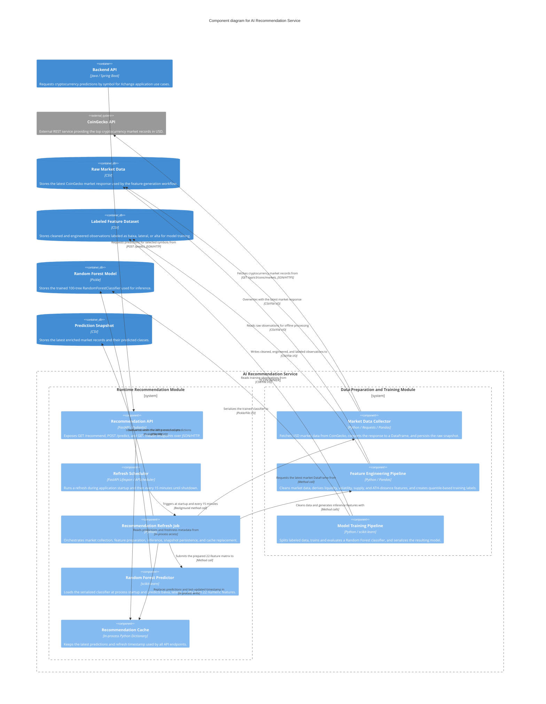

# Xchange C4: Crypto Recommendation AI Component

```mermaid
C4Component
title Component diagram for AI Recommendation Service

Container(backendApi, "Backend API", "Java / Spring Boot", "Requests cryptocurrency predictions by symbol for Xchange application use cases.")
System_Ext(coinGecko, "CoinGecko API", "External REST service providing the top cryptocurrency market records in USD.")

ContainerDb(rawMarketData, "Raw Market Data", "CSV", "Stores the latest CoinGecko market response used by the feature-generation workflow.")
ContainerDb(featureDataset, "Labeled Feature Dataset", "CSV", "Stores cleaned and engineered observations labeled as baixa, lateral, or alta for model training.")
ContainerDb(modelArtifact, "Random Forest Model", "Pickle", "Stores the trained 100-tree RandomForestClassifier used for inference.")
ContainerDb(predictionSnapshot, "Prediction Snapshot", "CSV", "Stores the latest enriched market records and their predicted classes.")

Container_Boundary(aiCoin, "AI Recommendation Service") {
  Boundary(runtimeModule, "Runtime Recommendation Module") {
    Component(recommendationApi, "Recommendation API", "FastAPI / Pydantic", "Exposes GET /recommend, POST /predict, and GET /health endpoints over JSON/HTTP.")
    Component(refreshScheduler, "Refresh Scheduler", "FastAPI Lifespan / APScheduler", "Runs a refresh during application startup and then every 15 minutes until shutdown.")
    Component(recommendationJob, "Recommendation Refresh Job", "Python", "Orchestrates market collection, feature preparation, inference, snapshot persistence, and cache replacement.")
    Component(modelPredictor, "Random Forest Predictor", "scikit-learn", "Loads the serialized classifier at process startup and predicts baixa, lateral, or alta from 22 numeric features.")
    Component(recommendationCache, "Recommendation Cache", "In-process Python Dictionary", "Keeps the latest predictions and refresh timestamp used by all API endpoints.")

    Rel(recommendationApi, recommendationCache, "Reads predictions and freshness metadata from", "In-process access")
    Rel(refreshScheduler, recommendationJob, "Triggers at startup and every 15 minutes", "Background method call")
    Rel(recommendationJob, modelPredictor, "Submits the prepared 22-feature matrix to", "Method call")
    Rel(recommendationJob, recommendationCache, "Replaces predictions and last-updated timestamp in", "In-process write")
  }

  Boundary(dataAndTrainingModule, "Data Preparation and Training Module") {
    Component(marketCollector, "Market Data Collector", "Python / Requests / Pandas", "Fetches USD market data from CoinGecko, converts the response to a DataFrame, and persists the raw snapshot.")
    Component(featurePipeline, "Feature Engineering Pipeline", "Python / Pandas", "Cleans market data, derives liquidity, volatility, supply, and ATH-distance features, and creates quantile-based training labels.")
    Component(trainingPipeline, "Model Training Pipeline", "Python / scikit-learn", "Splits labeled data, trains and evaluates a Random Forest classifier, and serializes the resulting model.")
  }

  Rel(recommendationJob, marketCollector, "Requests the latest market DataFrame from", "Method call")
  Rel(recommendationJob, featurePipeline, "Cleans data and generates inference features with", "Method calls")
}

Rel(backendApi, recommendationApi, "Requests predictions for selected symbols from", "POST /predict, JSON/HTTP")

Rel(marketCollector, coinGecko, "Fetches cryptocurrency market records from", "GET /api/v3/coins/markets, JSON/HTTPS")
Rel(marketCollector, rawMarketData, "Overwrites with the latest market response", "CSV/File I/O")

Rel(featurePipeline, rawMarketData, "Reads raw observations for offline processing", "CSV/File I/O")
Rel(featurePipeline, featureDataset, "Writes cleaned, engineered, and labeled observations to", "CSV/File I/O")

Rel(trainingPipeline, featureDataset, "Reads training observations from", "CSV/File I/O")
Rel(trainingPipeline, modelArtifact, "Serializes the trained classifier to", "Pickle/File I/O")

Rel(modelPredictor, modelArtifact, "Loads once when the API process starts", "Pickle/File I/O")
Rel(recommendationJob, predictionSnapshot, "Overwrites with the latest enriched predictions", "CSV/File I/O")

UpdateRelStyle(backendApi, recommendationApi, $offsetY="-30", $offsetX="-40")
UpdateRelStyle(recommendationJob, recommendationCache, $offsetY="30", $offsetX="20")
UpdateRelStyle(trainingPipeline, modelArtifact, $offsetY="20", $offsetX="-30")
```
