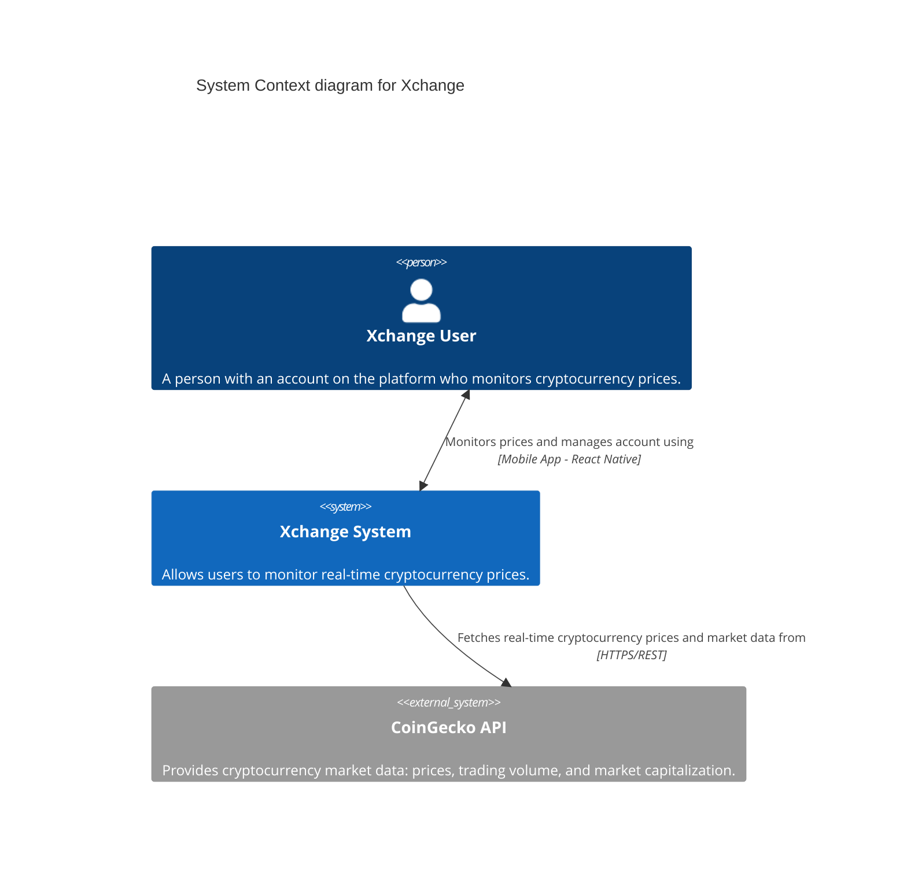

# Xchange C4: Context

```mermaid
C4Context
  title System Context diagram for Xchange

  Person(user, "Xchange User", "A person with an account on the platform who monitors cryptocurrency prices.")

  System(xchangeSystem, "Xchange System", "Allows users to monitor real-time cryptocurrency prices.")

  System_Ext(coingeckoApi, "CoinGecko API", "Provides cryptocurrency market data: prices, trading volume, and market capitalization.")

  BiRel(user, xchangeSystem, "Monitors prices and manages account using", "Mobile App - React Native")
  Rel(xchangeSystem, coingeckoApi, "Fetches real-time cryptocurrency prices and market data from", "HTTPS/REST")
```